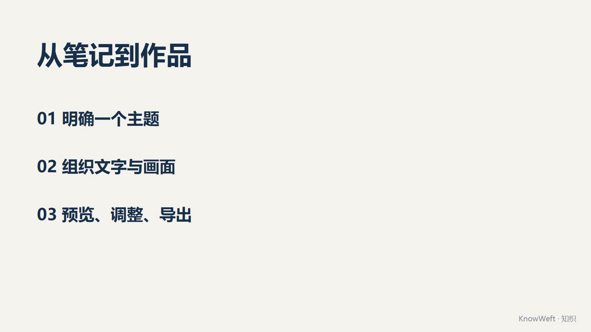

# KnowWeft · 知织

  

  

把知识和想法整理成可编辑的视频与课件。在本地维护知识树，一键生成教学场景，配图配音，导出 MP4 视频；也支持把讲义导出为可继续编辑的 PowerPoint（PPTX）文件。

全部数据保存在你自己的电脑上；AI 服务自带配置入口，不强制依赖任何云端账号。

## 下载

前往 [Releases 最新版](https://github.com/cyamz/KnowWeft/releases/latest)：

| 系统 | 推荐下载 | 说明 |
|---|---|---|
| Windows | `KnowWeft-Setup-版本-x64.exe` | 安装版，桌面/开始菜单启动 |
| Windows | `KnowWeft-Portable-版本-x64.exe` | 免安装单文件 |
| Linux | `KnowWeft-版本-x86_64.AppImage` | 免安装，chmod +x 后运行 |
| Linux | `KnowWeft-版本-amd64.deb` | Debian/Ubuntu 安装包 |

每个版本附 `SHA256SUMS.txt` 校验文件。

## 主要能力

- **知识树**：概念/流程/对比/时间线等 14 类节点，支持 JSON 导入导出与本地文件夹挂载。
- **场景生成**：从树或子树生成教学场景，AI 生成讲稿、提示词与配图（AI 服务自行配置）。
- **视频工程**：时间线编辑器、动画与字幕、可撤销编辑，Remotion 引擎渲染导出 MP4。
- **PPTX 双向**：工程导出为原生可编辑 PPTX（形状/文本/动画），也可从 PPTX 提取大纲建树。
- **本地优先**：工程、素材、成片全部落在本地文件库，不经过第三方服务器。

## 反馈与路线

- Bug 与功能建议请提 [Issues](https://github.com/cyamz/KnowWeft/issues)
- 版本历史见 [CHANGELOG](./CHANGELOG.md)

本仓库是**分发仓库**，只存放说明文档与发布文件；当前阶段源码暂不公开，开源计划将随路线图公布。

## 授权

下载与使用本软件受 [LICENSE](./LICENSE.txt) 约束。本项目暂未采用开源许可证发布；在开源之前，你依然可以免费使用已发布的版本。
